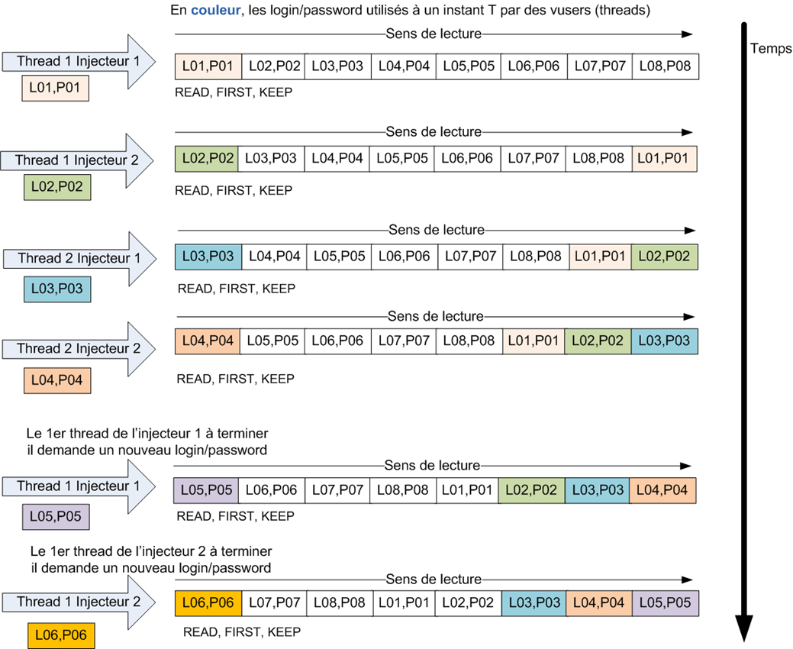
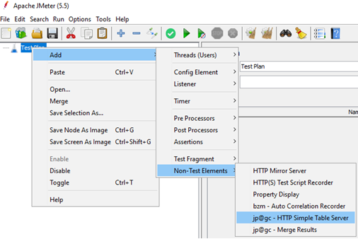
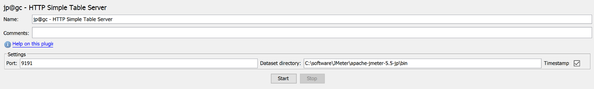

# JMeter Plugin Http Simple Table Server (STS) en profondeur

# Du besoin à la création du plugin STS

## D’une application web dans Tomcat
L’idée d’avoir un serveur pour gérer le jeu de données est née lors des tests de performance de l’application de déclaration des impôts sur le revenu du Ministère de Finance Publique Française en 2012.<br/>
Le jeu de données était constitué de millions de lignes pour simuler des dizaines de milliers de personnes qui remplissaient leur feuille de déclaration des revenus par heure et il y avait une douzaine d’injecteurs pour répartir la charge d’injection d’un tir de performance.<br/>
Le jeu de données était consommé, c’est-à-dire qu’une fois la ligne avec les informations de la personne était lue ou consommée, on ne pouvait plus prendre les informations de la personne une nouvelle fois.<br/>
La gestion du jeu de données de façon centralisée avait été implémentée avec une web application en Java (war) tournant dans un Tomcat. <br/>
Les injecteurs demandant à l’application web une ligne du jeu de données.<br/>

##	A un plugin pour Apache JMeter
Le besoin d’avoir une gestion centralisée du jeu de données en particulier avec une architecture de plusieurs injecteurs JMeter a été à l’origine de la création en 2014 du plugin pour Apache JMeter nommé Http Simple Table Server ou STS. <br/>
Ce plugin reprend des fonctionnalités de l’application dédiée pour Tomcat précédent citée mais avec une solution technique plus légère et simple à base de la librairie NanoHttpd.

# Gérer le jeu de données avec Http Simple Table Server (STS)
## Ajout d’une gestion centralisée du jeu de données

Les tests de performance avec JMeter peuvent se faire avec plusieurs injecteurs JMeter ou générateurs de charge (sans interface, sur une machine distante) et un contrôleur JMeter (avec interface utilisateur ou en ligne de commande sur la machine locale).

Le script JMeter et les properties sont envoyés par le protocole RMI vers les injecteurs.<br/>
Les résultats des appels sont retournés périodiquement au contrôleur JMeter.

Cependant le jeu de données, les fichiers csv ne sont pas transférés du contrôleur vers les injecteurs.<br/>


Il n’est pas possible nativement avec JMeter de lire le jeu de données aléatoirement ou dans l’ordre inverse. Il existe toutefois plusieurs plugins externes qui permettent de lire aléatoirement un fichier de données mais pas de façon centralisée.

Il n’est pas possible nativement de sauvegarder dans un fichier des données créées lors des tests comme des numéros de dossier ou de nouveaux documents.<br/>
La possibilité de sauvegarder des valeurs peut se faire avec du script Groovy dans JMeter mais pas de façon centralisée si on utilise plusieurs injecteurs durant le tir de performance.

L’idée principale est d’utiliser un petit serveur http pour gérer les fichiers du jeu de données avec des commandes simples pour récupérer ou ajouter des lignes de données dans les fichiers de données.

Ce serveur http peut être lancé tout seul en programme externe ou dans l’outil JMeter.

Le serveur Http s’appelle « Simple Table Server » ou STS.

Le nom STS est aussi une référence au programme Virtual Table Server (VTS) de LoadRunner avec des fonctionnalités différentes, une implémentation technique différente mais proche dans les cas d’usage.

Le STS est très utile dans un test avec plusieurs injecteurs JMeter mais il est apporte aussi des **fonctionnalités intéressantes** avec un **seul JMeter** pour les tests de performance.

## Quelques possibilités d’utilisation du Http Simple Table Server
### Lecture de données de façon répartie et sans collision
Certaines applications ne **tolèrent pas** que **2 utilisateurs** se connectent avec le **même login** en **même temps**.<br/>
Il est souvent recommandé de ne pas utiliser les mêmes données pour 2 utilisateurs connectés avec le même login en même temps pour éviter des conflits sur les données utilisées<br/>

Le STS peut facilement gérer le jeu de données de façon distribuée pour faire en sorte que les logins soient différents pour chaque virtual user à un instant T du test.<br/>

Il faut un jeu de données avec les logins/password avec un nombre de lignes supérieur au nombre de threads actifs à un instant T.<br/>

On charge manuellement, au démarrage du STS ou par script le fichier des logins/password et les injecteurs demande au STS une ligne avec login/password par la commande READ, KEEP=TRUE et READ_MODE=FIRST.

On peut considérer que la lecture du jeu de données se fait de façon circulaire.



### Lecture des données à usage unique
Le jeu de données peut être à usage unique, c'est-à-dire qu’on l’utilise une seule fois durant le test.<br/>
Par exemple des personnes qui s’enregistrent sur un site, elles ne peuvent plus s’enregistrer avec les même informations car le système détecte un doublon.

Des dossiers sont en attente de validation par un administrateur, quand les dossiers sont validés, ils ne sont plus dans le même état et on ne peut plus les valider à nouveau.

Pour cela, on va lire un fichier de données en mémoire du http STS et les virtuals users vont lire en supprimant de la valeur en tête de liste.

A l’arrêt du test, on peut sauvegarder les valeurs qui restent en mémoire dans un fichier (avec ou sans préfixe timestamp) ou bien laisser le http STS tourner pour un autre test en gardant les valeurs encore en mémoire.


### Producteurs et consommateurs d’une file d’attente (queue)

Avec le STS, on peut gérer une file d’attente avec des producteurs qui déposent dans la file et des consommateurs qui consomment les données de la file d’attente.

Dans la pratique, on démarre un script avec des producteurs qui créent des données comme des nouveaux dossiers ou des nouvelles personnes enregistrées. Les identifiants de dossiers créés ou les informations de personnes nouvellement enregistrées sont stockés dans le http STS par la commande ADD en mode ADD_MODE=LAST

Les consommateurs démarrent un peu plus tard afin qu’il y ait des données dans la file d’attente.<br/>
Il faut également que les consommateurs ne consomment pas trop rapidement par rapport aux producteurs ou bien il faut gérer le cas où la liste ne contient plus de la valeur en détectant qu’il n’y a plus de valeur disponible et attendre quelques secondes avant de réitérer en boucle.

Les consommateurs consomment les valeurs par la commande READ, FIRST, KEEP=FALSE.

Un schéma pour expliquer les producteurs ADD et les consommateurs READ dans la même file d'attente.


### Producteur et consommateur avec recherche par FIND
Il s’agit d’une variante de la précédente solution.<br/>
Producteur :<br/>
Un utilisateur avec des droits limités à un secteur géographique crée des dossiers et ajoute une ligne avec son login + le numéro du dossier. (ex : **login23;D12223**)<br/>
 - login1;D120000
 - login2;D120210
 - **login23;D12223**
 - login24;D12233
 - login2;D120214
 - login23;D12255


Consommateur :<br/>
Un utilisateur va modifier les caractéristiques du dossier mais pour cela il doit choisir dans la liste en mémoire uniquement les lignes avec le même login que celui qu’il utilise actuellement pour des questions de droits et de secteur géographique.<br/>
Recherche dans la liste avec la commande FIND et FIND_MODE=SUBSTRING et la chaine recherchée est le login de la personne connectée (ex : login23) donc LINE=**login23;** (avec le séparateur ;).<br/>
Ainsi la ligne retournée sera la 1ère ligne avec le login23 et le numéro de dossier sera utilisé dans la recherche des dossiers dans l’application testée.<br/>
Ici résultat du FIND par sous chaine (SUBSTRING) est  : **login23;D12223** <br/>
La ligne peut être consommée avec KEEP=FALSE ou bien gardée et placée en fin de liste avec KEEP=TRUE

### Enrichir le jeu de données au fur et à mesure du tir
L’idée est de partir avec un jeu de données réduit qui est lu au démarrage du tir et d’ajouter au fur et à mesure du tir de nouvelles lignes au jeu de données initiales afin d’augmenter ou enrichir le jeu de données. Le jeu de données est donc plus grand en fin de tir qu’au début. En fin de tir, le jeu de données enrichie peut être sauvegardé avec la commande SAVE et le nouveau fichier pourra être le futur fichier en entrée pour un nouveau tir. <br/>
Par exemple, on ajoute des personnes par un scénario et on ajoute au jeu de données de recherche ces personnes dans la liste ainsi la recherche se fait sur les premières personnes du fichier lu au début mais aussi les personnes ajoutées au fur et à mesure du test de performance.

###	Vérification du jeu de données
Le jeu de données initial peut contenir des valeurs qui vont générer des erreurs dans le script car la navigation tombe dans un cas particulier ou la valeur saisie est refusée car incorrecte ou déjà existante.

On lit le jeu de données par INITFILE ou au démarrage du STS, on lit (READ) et on utilise la valeur si le script va jusqu’au bout (le Thread Group est configuré avec "**Start Next Thread Loop** on Sampler Error"), on enregistre la valeur par ADD dans un fichier (valeursok.csv). A la fin du test, on enregistre les valeurs du fichier valeursok.csv (par exemple avec un "tearDown Thread Group").<br/>
On utilisera par la suite les données vérifiées du fichier valeursok.csv

### Mémorisation des valeurs ajoutées dans un fichier.
Dans le script, les valeurs ajoutées dans la base de données de l’application sont enregistrées dans par la commande ADD dans un fichier. A la fin du test, on enregistre les valeurs en mémoire dans un fichier (par exemple avec un "tearDown Thread Group").<br/>
Le fichier contenant les valeurs créées peut être utilisé pour vérifier à postériori les ajouts en base ou pour effacer les valeurs créées afin de revenir dans un état initial avant le test.<br/>

Un script dédié à la création d’un jeu de données peut créer des valeurs et les stocker dans un fichier de données. Ce fichier sera alors utilisé dans le script JMeter lors des tirs de performance.

A l’opposé, un script d’effacement dédié peut prendre le fichier des valeurs créées pour les effacer en boucle.

### Communication entre logiciels
Le http STS peut être utilisé comme moyen de communiquer des valeurs entre JMeter et un autre logiciel.<br/>
Le logiciel peut être un client lourd, une application web, un script shell, un test Selenium, un autre JMeter, un LoadRunner …

On peut aussi lancer 2 tests en ligne de commande avec JMeter à la suite en utilisant un STS « autonome externe » comme moyen de stocker des valeurs créées par le 1er test et utilisées dans le 2ème test JMeter.

Le logiciel peut ajouter ou lire des valeurs en appelant l’url du http STS et JMeter peut lire ces valeurs ajoutées ou bien en ajouter lui-même.

Cette possibilité facilite les tests de performance mais aussi des tests de non-régression.


### Moyen centralisé d’arrêter proprement un tir
#### Arret progressif du test sur tous les injecteurs JMeter
Dans JMeter il n’existe pas la notion comme dans LoadRunner de « GradualExiting », c’est-à-dire d’indiquer au vuser à la fin de l’itération s’il doit continuer ou bien de pas réitérer et donc s’arrêter.

On peut simuler ce « GradualExiting » avec le STS et un peu de code dans le script JMeter.<br/>
Avec le STS on peut charger un fichier « etat.csv » qui contient une ligne avec une valeur particulier comme la ligne « RUN », le vuser demande au début de l’itération la valeur de la ligne du fichier « etat.csv ».<br/>
Si la valeur est égale à « STOP » alors le vuser s’arrête si la valeur est nulle ou bien différent de STOP comme « RUN » alors le vuser continue l’itération.<br/>


#### Arret progressif du test après une date heure fixe
On peut également par ce système programmer la demande d’arrêt à une heure fixe.<br/>
On indique en paramètre la date et l’heure pour modifier la valeur de l’état à STOP par exemple 2024-07-31_14h30m45s.<br/>
Par un script JMeter qui tourne en plus du tir en cours.

Le script se lance, on calcule le nombre de milli secondes avant la date indiquée d’arrêt demandée.<br/>
Le vuser est mise en attente sur le durée calculée.<br/>
Puis le fichier « etat.csv » dans le STS est effacé pour mettre la valeur STOP qui va permettre au 2ème script JMeter qui tourne déjà de récupérer la valeur « STOP » et de s’arrêter proprement sur l’ensemble des injecteurs JMeter ou du JMeter seul.


## Démarrer le Http Simple Table Server
### Déclaration et démarrage du STS par l’interface graphique
Le Simple Table Server se trouve dans le menu « Non-Test Elements » <br/>


Cliquer sur le bouton « Start » pour démarrer le http STS.<br/>
Par défaut, le répertoire contenant les fichiers est &lt;JMETER_HOME&gt;/bin




### Démarrer en ligne de commande.
Il est possible de démarrer le serveur STS en ligne de commande.<br/>
&lt;JMETER_HOME&gt;\bin\simple-table-server.cmd (Windows OS)<br/>
&lt;JMETER_HOME&gt;>/bin/simple-table-server.sh (Linux OS)

ou automatiquement lors du démarrage de JMeter en ligne de commande (CLI) en déclarant le fichier ces 2 lignes dans jmeter.properties<br/>
jsr223.init.file=simple-table-server.groovy<br/>
jmeterPlugin.sts.loadAndRunOnStartup=true si la Valeur vaut false alors le STS n’est pas démarré au lancement de JMeter en ligne de commande sans GUI.<br/>

Le port part défaut est le 9191, il peut être changer par la property<br/>
&#35; jmeterPlugin.sts.port=9191<br/>
Si jmeterPlugin.sts.port=0 alors le STS ne démarre pas au lancement de JMeter en mode CLI.

La property jmeterPlugin.sts.addTimestamp=true indique si la sauvegarde du fichier (ex info.csv) sera préfixée par la date est l’heure, ex : 20240112T13h00m50s.info.csv sinon jmeterPlugin.sts.addTimestamp=false écrit/écrase le fichier info.csv<br/>
&#35; jmeterPlugin.sts.addTimestamp=true

La property jmeterPlugin.sts.daemon=true est utilisée quand le STS est lancé en application externe avec la commande linux nohup (exemple : nohup ./simple-table-server.sh &).<br/>
Dans ce cas le STS n’écoute pas le clavier la touche &lt;ENTER&gt; pour quitter.<br/>
Le STS rentre en boucle infinie, il faut appeler la commande /sts/STOP pour arrêter le STS ou bien le killer.<br/>

Quand jmeterPlugin.sts.daemon=false le STS attend la saisie de &lt;ENTER&gt; pour quitter, c’est le mode par défaut.<br/>
jmeterPlugin.sts.daemon=false

## Chargement de fichiers au démarrage du Simple Table Server
Le STS a la possibilité de charger des fichiers en mémoire au démarrage du STS.<br/>
Le chargement des fichiers se fait quand le STS est lancé en application externe (&lt;JMETER_HOME&gt;\bin\simple-table-server.cmd ou &lt;JMETER_HOME&gt;/bin/simple-table-server.sh) et aussi quand JMeter est lancé en ligne de commande sans GUI ou via le JMeter Maven Plugin.

Le chargement des fichiers ne se fait **pas** avec JMeter en mode **GUI**.

Les fichiers sont lus dans le répertoire indiqué par la property : **jmeterPlugin.sts.datasetDirectory** et si cette property est nulle alors dans le répertoire &lt;JMETER_HOME&gt;/bin<br/>

La déclaration des fichiers à charger se fait par les properties suivantes :<br/>
jmeterPlugin.sts.initFileAtStartup=article.csv,nom_fichier.csv<br/>
jmeterPlugin.sts.initFileAtStartupRegex=false<br/>
ou<br/>
jmeterPlugin.sts.initFileAtStartup=.+?\.csv<br/>
jmeterPlugin.sts.initFileAtStartupRegex=true<br/>

Quand jmeterPlugin.sts.initFileAtStartupRegex=false alors la property jmeterPlugin.sts.initFileAtStartup contient la liste de fichiers à charger avec comme séparateur des noms de fichier le caractère virgule « , ».
Ex :
jmeterPlugin.sts.initFileAtStartup=article.csv,nom_fichier.csv<br/>
Le STS au démarrage va tenter de charger (INITFILE) les fichiers articles.csv puis nom_fichiers.csv

Quand jmeterPlugin.sts.initFileAtStartupRegex=true alors la property jmeterPlugin.sts.initFileAtStartup contient une expression régulière qui va servir à matcher les fichiers du répertoire de la property jmeterPlugin.sts.datasetDirectory.

Ex :
jmeterPlugin.sts.initFileAtStartup=.+?\.csv<br/>
Charge en mémoire (INITFILE) tous les fichiers dont l’extension est « .csv »<br/>

Le nom du fichier ne doit pas contenir des caractères spéciaux qui permettraient de changer le répertoire de lecture comme ..\..\fichier.csv ou /etc/passwd ou ../../../tomcat/conf/server.xml

La taille maximum du nom d’un fichier est de 128 caractères (sans prendre en compte le chemin du répertoire).

## Gestion de l’encodage des fichiers à lire/écrire et de la réponse html
Il est possible de définir l’encodage à la lecture des fichiers ou à l’écriture des fichiers de données.<br/>
Les properties sont les suivantes :<br/>
&#35; read (INITFILE) or write (SAVE) file with accent from text file in the charset like UTF-8 or ISO8859_15<br/>
&#35;  All csv files need to be in the same charset encoding<br/>
jmeterPlugin.sts.charsetEncodingReadFile=UTF-8<br/>
jmeterPlugin.sts.charsetEncodingWriteFile=UTF-8<br/>

Les fichiers seront lus (INITFILE) avec le charset déclaré par la valeur de jmeterPlugin.sts.charsetEncodingReadFile<br/>
Les fichiers seront écrits (SAVE) avec le charset déclaré par la valeur de jmeterPlugin.sts.charsetEncodingWriteFile<br/>

La valeur par défaut jmeterPlugin.sts.charsetEncodingReadFile correspond à la property System property : file.encoding<br/>
La valeur par défaut jmeterPlugin.sts.charsetEncodingWriteFile correspond à la property System property : file.encoding<br/>

Tous les fichiers de données doivent être dans le même charset s’ils contiennent des caractères non ASCII.

Pour répondre en HTML aux différentes commandes en particulier READ, le charset qui se trouve dans le header de la réponse est indiqué par jmeterPlugin.sts.charsetEncodingHttpResponse.

jmeterPlugin.sts.charsetEncodingHttpResponse=<charset> (Use UTF-8) in the http header add "Content-Type:text/html; charset=<charset>",<br/>
La valeur par défaut est la JMeter property : sampleresult.default.encoding


La liste des charsets est déclarée dans la page HTML (prendre la colonne java.io API)<br/>
&#35; For the name of the charset look at : https://docs.oracle.com/javase/8/docs/technotes/guides/intl/encoding.doc.html<br/>
&#35; Colum Canonical Name for java.io API and java.lang API

###	Aide à l’utilisation
L’URL d’une commande du STS est de la forme :<br/>
&lt;HOSTNAME&gt;:&lt;PORT&gt;/sts/&lt;COMMAND&gt;?&lt;PARAMETERS&gt;<br/>

Les commandes et le nom des paramètres sont en majuscule (sensible à la casse).<br/>

Si aucune commande n’est indiquée alors le message d’aide est retourné :<br/>

http://localhost:9191/sts/


# Liste des commandes et configuration du http STS avec des extraits de la documentation du site jmeter-plugins.org
Les appels sont atomiques (avec **synchronized**) => La lecture ou l’ajout vont jusqu’au bout du traitement en cours avant de traiter la demande suivante.

Les commandes vers le Simple Table Server sont réalisées par des appels http GET et/ou POST selon la commande.

La documentation est disponible sur le site Internet de jmeter plugin à l’URL :<br/>
http://jmeter-plugins.org/wiki/HttpSimpleTableServer

## Distributed architecture for JMeter
The Simple Table Server runs on the JMeter controller (master) and load generators (slaves) or injectors make calls to the STS to get, find or add some data.<br/>
At the beginning of the test, the first load generator will load data in memory (initial call) and at the end of the test it asks the STS saving values in a file.<br/>
All the load generators ask data from the same STS which is started on the JMeter controller.<br/>

The INITFILE can also be done at STS startup time (without the first load generator initial call)<br/>


Example of a dataset file logins.csv:<br/>
<pre>
login1;password1
login2;password2
login3;password3
login4;password4
login5;password5
</pre>

### INITFILE - Load file in memory
http&#58;//hostname:port/sts/**INITFILE**?FILENAME=logins.csv<br/>
HTML format:
```HTML
<html><title>OK</title>
<body>5</body> => number of lines read
</html>
```

Linked list after this command:<br/>
<pre>
login1;password1
login2;password2
login3;password3
login4;password4
</pre>

The files are read in the directory indicated by the property: **jmeterPlugin.sts.datasetDirectory** and if this property is null then in the directory &lt;JMETER_HOME&gt;/bin<br/>

### READ - Get one line from list
http&#58;//hostname:port/sts/**READ**?READ_MODE={FIRST, LAST, RANDOM}&KEEP={TRUE, FALSE}&FILENAME=logins.csv<br/>
HTML format:
```HTML
<html><title>OK</title>
<body>login1;password1</body>
</html> 
```

Avalables options:
- READ_MODE=FIRST => login1;password1
- READ_MODE=LAST => login5;password5
- READ_MODE=RANDOM => login?;password?
- KEEP=TRUE => the data is kept and put to the end of list
- KEEP=FALSE => the data is removed


### READMULTI - Get multi lines from list in one request 

GET Protocol
http&#58;//hostname:port/sts/**READMULTI**?FILENAME=logins.csv&NB_LINES={Nb lines to read}&READ_MODE={FIRST, LAST, RANDOM}&KEEP={TRUE, FALSE}

Available options:
- NB_LINES=Number of lines to read : 1 <= Nb lines (Integer) and Nb lines <= list size
- READ_MODE=FIRST =>start to read at the first line
- READ_MODE=LAST => start to read at the last line (reverse)
- READ_MODE=RANDOM => read n lines randomly
- KEEP=TRUE => the data is kept and put to the end of list
- KEEP=FALSE => the data is removed

### ADD - Add a line into a file (GET OR POST HTTP protocol)
FILENAME=dossier.csv, LINE=D0001123, ADD_MODE={FIRST, LAST}

HTML format:
```HTML
<html><title>OK</title>
<body></body> 
</html>
```

Available options:
- ADD_MODE=FIRST => add to the begin of the list
- ADD_MODE=LAST => add to the end of the list
- FILENAME=dossier.csv => if doesn't already exist it creates a LinkList in memory
- LINE=1234;98763 => the line to add
- UNIQUE => do not add line if the list already contains such line (return KO)


http POST Request<br/>


Method GET :<br/>
GET Protocol<br/>
http&#58;//hostname:port/sts/**ADD**?FILENAME=dossier.csv&LINE=D0001123&ADD_MODE={FIRST, LAST}

###	FIND – Find a line in the file (GET OR POST HTTP protocol)
Command FIND <br/>
Find a line (LINE) in a file (FILENAME) (GET OR POST HTTP protocol)

The LINE to find is for FIND_MODE :
- A string this SUBSTRING (Default, ALineInTheFile contains the stringToFind) or EQUALS (stringToFind == ALineInTheFile)
- A regular expression with REGEX_FIND (contains) and REGEX_MATCH (entire region the pattern)
- KEEP=TRUE => the data is kept and put to the end of list
- KEEP=FALSE => the data is removed

GET Protocol:<br/>
http&#58;//hostname:port/sts/**FIND**?FILENAME=colors.txt&LINE=(BLUE|RED)&[FIND_MODE=\[SUBSTRING,EQUALS,REGEX_FIND,REGEX_MATCH\]]&KEEP={TRUE, FALSE}

If find return the first line finded, start reading at first line in the file (linked list)<br/>
```HTML
<html><title>OK</title>
<body>RED</body>
</html> 
```

If NOT find return title KO and message "Error : Not find !" in the body<br/>
```HTML
<html><title>KO</title>
<body>Error : Not find !</body>
</html> 
```
### LENGTH - Return the number of remaining lines of a linked list
http&#58;//hostname:port/sts/**LENGTH**?FILENAME=logins.csv<br/>
HTML format:<br/>
```HTML
<html><title>OK</title>
<body>5</body> => remaining lines
</html>
```

### STATUS - Display the list of loaded files and the number of remaining lines
http&#58;//hostname:port/sts/**STATUS**<br/>
HTML format:<br/>
```HTML
<html><title>OK</title>
<body>
logins.csv = 5<br />
dossier.csv = 1<br />
</body>
</html>
``` 
### SAVE - Save the specified linked list in a file to the datasetDirectory location
http&#58;//hostname:port/sts/**SAVE**?FILENAME=logins.csv

If jmeterPlugin.sts.addTimestamp is set to true then a timestamp will be added to the filename, the file is stored in jmeterPlugin.sts.datasetDirectory or if null in the &lt;JMETER_HOME&gt;/bin directory:<br/>
20240520T16h33m27s.logins.csv

You can force the addTimestamp value with parameter ADD_TIMESTAMP in the url like :
http&#58;//hostname:port/sts/SAVE?FILENAME=logins.csv&**ADD_TIMESTAMP**={true,false}

HTML format:<br/>
```HTML
<html><title>OK</title>
<body>5</body> => number of lines saved
</html>
```

### RESET - Remove all elements from the specified list:
http&#58;//hostname:port/sts/**RESET**?FILENAME=logins.csv

HTML format:<br/>
```HTML
<html><title>OK</title>
<body></body>
</html>
``` 
Reset Command is often used in the “setUp Thread Group” to clear the values in memory Linked List from a previous test.

Always returns OK even if the file did not exist


### STOP - Shutdown the Simple Table Server:
http&#58;//hostname:port/sts/**STOP**

The stop command is used usually when the HTTP STS server was launched by a script shell and we want to stop the STS at the end of the test.<br/>
When the jmeterPlugin.sts.daemon=true, you need to call http://hostname:port/sts/STOP or kill the process to stop the STS

### CONFIG – Display STS configuration
http&#58;//hostname:port/sts/**CONFIG**<br/>
Display the STS configuration<br/>
E.g :
```
jmeterPlugin.sts.loadAndRunOnStartup=false
startFromCli=true
jmeterPlugin.sts.port=9191
jmeterPlugin.sts.datasetDirectory=null
jmeterPlugin.sts.addTimestamp=true
jmeterPlugin.sts.demon=false
jmeterPlugin.sts.charsetEncodingHttpResponse=UTF-8
jmeterPlugin.sts.charsetEncodingReadFile=UTF-8
jmeterPlugin.sts.charsetEncodingWriteFile=UTF-8
jmeterPlugin.sts.initFileAtStartup=
jmeterPlugin.sts.initFileAtStartupRegex=false
databaseIsEmpty=false
```

### Error response, KO
When the command and/or a parameter are wrongs, the result is a page html status 200 but the **title** contains the label **KO**.

Examples :
Send a unknown command, be careful Command a case sensitive (READ != read)<br/>
```HTML
<html><title>KO</title>
<body>Error : unknown command !</body>
</html>
```

Try to read value from a file not yet load with INITFILE<br/>
```HTML
<html><title>KO</title>
<body>Error : logins.csv not loaded yet !</body>
</html>
```

Try to read value from a file but no more line in the Linked List<br/>
```HTML
<html><title>KO</title>
<body>Error : No more line !</body>
</html>
```

Try to save lines in a file what contains illegal character like “..”, “:”<br/>
```HTML
<html><title>KO</title>
<body>Error : Illegal character found !</body>
</html>
```

Command FIND<br/>
```HTML
<html><title>KO</title>
<body>Error : Not find !</body>
</html>
```

Command FIND and FIND_MODE=REGEX_FIND or REGEX_MATCH<br/>
```HTML
<html><title>KO</title>
<body>Error : Regex compile error !</body>
</html>
```

## Modification des paramètres du STS en ligne de commande
You can override STS settings using command-line options:<br/>
<pre>
-DjmeterPlugin.sts.port=&lt;port number&gt;
-DjmeterPlugin.sts.loadAndRunOnStartup=&lt;true/false&gt;
-DjmeterPlugin.sts.datasetDirectory=&lt;path/to/your/directory&gt;
-DjmeterPlugin.sts.addTimestamp=&lt;true/false&gt;
-DjmeterPlugin.sts.daemon=&lt;true/false&gt;
-DjmeterPlugin.sts.charsetEncodingHttpResponse=&lt;charset like UTF-8&gt;
-DjmeterPlugin.sts.charsetEncodingReadFile=&lt;charset like UTF-8&gt;
-DjmeterPlugin.sts.charsetEncodingWriteFile=&lt;charset like UTF-8&gt;
-DjmeterPlugin.sts.initFileAtStartup=&lt;files to read when STS startup, e.g : article.csv,users.csv&gt;>
-DjmeterPlugin.sts.initFileAtStartupRegex=false=&lt;false : no regular expression, files with comma separator, true : read files matching the regular expression&gt;
</pre>

jmeter.bat -DjmeterPlugin.sts.loadAndRunOnStartup=true -DjmeterPlugin.sts.port=9191 -DjmeterPlugin.sts.datasetDirectory=c:/data -DjmeterPlugin.sts.charsetEncodingReadFile=UTF-8 -n –t testdemo.jmx

## STS dans le pom d’un test avec jmeter-maven-plugin

Il est possible d’utiliser de STS dans un tir de performance lancé avec le plugin jmeter-maven-plugin.<br/>
Pour cela :<br/>
If you want to use the Http Simple Server with the JMeter Maven plugin, you could:<br/>
- Put your csv files in &lt;project&gt;/src/test/jmeter directory (e.g : logins.csv)
- Put the simple-table-server.groovy (groovy script) in &lt;project&gt;/src/test/jmeter directory
- Put the your jmeter script in &gt;project&gt;/src/test/jmeter directory (e.g : test_login.jmx)
- Declare in the maven build section, in the configuration &gt; jmeterExtensions &gt; declare the artifact kg.apc:jmeter-plugins-table-server:&lt;version&gt;
- Declare user properties for STS configuration and automatic start
- If you use a localhost and a proxy configuration, you could add a proxy configuration with &lt;hostExclusions&gt;localhost&lt;/hostExclusions&gt;

Extract pom.xml dedicated to Http Simple Table Server :
```XML
    <build>
        <plugins>
            <plugin>
                <groupId>com.lazerycode.jmeter</groupId>
                <artifactId>jmeter-maven-plugin</artifactId>
                <version>3.8.0</version>
...
                <configuration>
                    <jmeterExtensions>
                        <artifact>kg.apc:jmeter-plugins-table-server:5.0</artifact>
                    </jmeterExtensions>
                    <propertiesUser>
                        <!-- properties configuration for Http Simple Table Server with automatic start when JMeter start -->
                        <jmeterPlugin.sts.port>9191</jmeterPlugin.sts.port>
                        <jmeterPlugin.sts.addTimestamp>true</jmeterPlugin.sts.addTimestamp>
                        <jmeterPlugin.sts.datasetDirectory>${project.build.directory}/jmeter/testFiles</jmeterPlugin.sts.datasetDirectory>
                        <jmeterPlugin.sts.loadAndRunOnStartup>true</jmeterPlugin.sts.loadAndRunOnStartup>
                        <jsr223.init.file>${project.build.directory}/jmeter/testFiles/simple-table-server.groovy</jsr223.init.file>
                    </propertiesUser>
                </configuration>
            </plugin>
        </plugins>
</build>
```