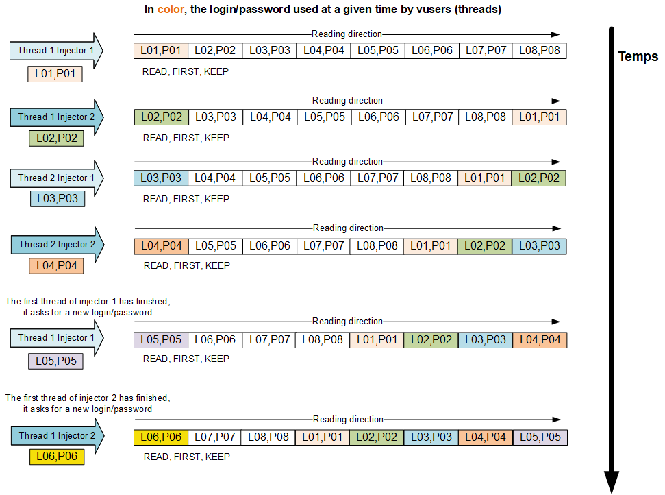

# JMeter Plugin Http Simple Table Server in depth

# From the need to the creation of the STS plugin

## From a web application in Tomcat
The idea of having a server to manage the dataset was born during the performance tests of the income tax declaration application of the French Ministry of Public Finance in 2012.<br/>
The dataset consisted of millions of lines to simulate tens of thousands of people who filled out their income tax return form per hour and there were a dozen injectors to distribute the injection load of a performance shot.<br/>
The dataset was consumed, that is to say that once the line with the person's information was read or consumed, we could no longer take the person's information again.<br/>
The management of the dataset in a centralized way had been implemented with a Java web application (war) running in a Tomcat. <br/>
Injectors requesting a row of the dataset from the web application.<br/>

## To a plugin for Apache JMeter
The need to have centralized management of the dataset, especially with an architecture of several JMeter injectors, was at the origin of the creation in 2014 of the plugin for Apache JMeter named Http Simple Table Server or STS. <br/>
This plugin takes over the features of the dedicated application for Tomcat mentioned above but with a lighter and simpler technical solution based on the NanoHttpd library.

# Manage the dataset with Http Simple Table Server (STS)
## Adding centralized management of the dataset

Performance tests with JMeter can be done with several JMeter injectors (without interface, on a remote machine) and a JMeter controller (with user interface, on the local machine).

JMeter scripts are sent by RMI protocol to injectors.<br/>
The results of the calls are returned periodically to the JMeter controller.

However the dataset and csv files are not transferred from the controller to the injectors.<br/>


It is not possible natively with JMeter to read the dataset randomly or in reverse order. However, there are several external plugins that allow you to randomly read a data file but not in a centralized way.

It is not possible natively to save data created during tests such as file numbers or new documents in a file.<br/>
The possibility of saving values can be done with Groovy script in JMeter but not in a centralized way if you use several injectors during the performance test.

The main idea is to use a small http server to manage the dataset files with simple commands to retrieve or add data lines to the data files.

This http server can be launched alone in an external program or in the JMeter tool.

The Http server is called "Simple Table Server" or STS.

The name STS is also a reference to the Virtual Table Server (VTS) program of LoadRunner with different functionalities, a different technical implementation but close in the use cases.

STS is very useful in a test with multiple JMeter injectors but it also brings **interesting features** with a **single JMeter** for performance testing.

## Some possibilities of using the Http Simple Table Server
### Reading data in a distributed and collision-free way
Some applications do not tolerate that 2 users connect with the same login at the same time.<br/>
The STS can easily manage the dataset in a distributed way to ensure that the logins are different for each virtual user.<br/>

A dataset with logins/passwords with a number of lines greater than the number of active threads at a given time is required.<br/>

We manually load, at the start of the STS or by script the logins/password file and the injectors ask the STS for a line with login/password by the command READ, KEEP=TRUE and READ_MODE=FIRST.

We can consider that the reading of the dataset is done in a circular way.



### Reading single-use data
The dataset can be single-use, meaning that it is used only once during the test.<br/>
For example, people who register on a site can no longer register with the same information because the system detects a duplicate.

Documents are awaiting validation by an administrator, when the documents are validated, they are no longer in the same state and can no longer be validated again.

To do this, we will read a data file in memory of the http STS and the virtual users will read by deleting the value at the top of the list.

When the tet is stopped, we can save the values that remain in memory in a file (with or without a timestamp prefix) or let the http STS run for another test while keeping the values ​​still in memory.


### Producers and consumers of a queue

With the STS, we can manage a queue with producers who deposit in the queue and consumers who consume the data of the queue.

In practice, we start a script with producers who create data like new documents or new registered people. The identifiers of created documents or the information of newly registered people are stored in the http STS by the ADD command in mode ADD_MODE=LAST 

The consumers start a little later so that there is data in the queue.<br/>
It is also necessary that the consumers do not consume too quickly compared to the producers or it is necessary to manage the case where the list no longer contains a value by detecting that there is no more value available and waiting a few seconds before repeating in a loop.

The consumers consume the values by the command READ, FIRST, KEEP=FALSE.


### Producer and consumer with search by FIND
This is a variation of the previous solution.<br/>
Producer:<br/>
A user with rights limited to a geographical sector creates documents and adds a line with his login + the document number. (ex: **login23;D12223**)<br/>
- login1;D120000
- login2;D120210
- **login23;D12223**
- login24;D12233
- login2;D120214
- login23;D12255

Consumer:<br/>
A user will modify the characteristics of the document but to do so he must choose from the list in memory only the lines with the same login as the one he currently uses for questions of rights and geographic sector.<br/>
Search in the list with the FIND command and FIND_MODE=SUBSTRING and the string searched for is the login of the connected person (ex: login23) so LINE=**login23;** (with the separator ;).<br/>
Thus the returned line will be the 1st line with login23 and the file number will be used in searching for files in the tested application.<br/>
Here the result of the FIND by substring (SUBSTRING) is: **login23;D12223** <br/>
The line can be consumed with KEEP=FALSE or kept and placed at the end of the list with KEEP=TRUE

### Enrich the dataset as the shot progresses
The idea is to start with a reduced dataset that is read at the start of the shot and to add new lines to the initial dataset as the shot progresses in order to increase or enrich the dataset. The dataset is therefore larger at the end of the shot than at the beginning. At the end of the shot, the enriched dataset can be saved with the SAVE command and the new file can be the future input file for a new shot. <br/>
For example, we add people by a scenario and we add to the search dataset these people in the list so the search is done on the first people of the file read at the beginning but also the people added as the performance test progresses.

### Verification of the dataset
The initial dataset can contain values that will generate errors in the script because the navigation falls into a particular case or the entered value is refused because it is incorrect or already exists.

We read the dataset by INITFILE or at the start of the STS, we read (READ) and we use the value if the script goes to the end (the Thread Group is configured with "**Start Next Thread Loop** on Sampler Error"), we save the value by ADD in a file (valuesok.csv). At the end of the test, the values of the valuesok.csv file are saved (for example with a "tearDown Thread Group").<br/>
The verified data of the valuesok.csv file will then be used

### Storing the added values in a file.
In the script, the values added to the application database are saved in a file by the ADD command. At the end of the test, the values in memory are saved in a file (for example with a "tearDown Thread Group").<br/>
The file containing the created values can be used to verify the additions to the database a posteriori or to delete the created values in order to return to an initial state before the test.<br/>

A script dedicated to creating a data set can create values and store them in a data file. This file will then be used in the JMeter script during performance tests.

On the other hand, a dedicated erase script can take the file of created values to erase them in a loop.

### Communication between software
The http STS can be used as a means to communicate values between JMeter and another software.<br/>
The software can be a heavy client, a web application, a shell script, a Selenium test, another JMeter, a LoadRunner …

We can also launch 2 command line tests with JMeter in a row by using an "external standalone" STS as a means to store values created by the 1st test and used in the 2nd JMeter test.

The software can add or read values by calling the url of the http STS and JMeter can read these added values or add them itself.

This possibility facilitates performance tests but also non-regression tests.

### Centralized way to stop a shot properly
In JMeter there is no notion as in LoadRunner of "GradualExiting", that is to say to indicate to the vuser at the end of the iteration if it should continue or not to repeat and therefore stop.

We can simulate this "GradualExiting" with the STS and a little code in the JMeter script.<br/>
With the STS we can load a file "status.csv" which contains a line with a particular value like the line "RUN", the vuser asks at the beginning of the iteration the value of the line of the file "status.csv".<br/>
If the value is equal to "STOP" then the vuser stops if the value is zero or different from STOP like "RUN" then the vuser.


We can also program the stop request at a fixed time with this system.<br/>
We indicate as a parameter the date and time to change the value of the status to STOP.<br/>
By a JMeter script that runs in addition to the current shot.

The script is launched, we calculate the number of milliseconds before the indicated date of requested stop.<br/>
The vuser is put on hold for the calculated duration.<br/>
Then the "status.csv" file in the STS is deleted to put the STOP value which will allow the 2nd JMeter script that is already running to recover the "STOP" value and to stop properly on all the JMeter injectors or the JMeter alone.


## Start the Http Simple Table Server
### Declaration and start of the STS by the graphical interface
The Simple Table Server is located in the "Non-Test Elements" menu <br/>


Click on the "Start" button to start the http STS.<br/>
By default, the directory containing the files is &lt;JMETER_HOME&gt;/bin


### Start from command line.
It is possible to start the STS server from command line.<br/>
&lt;JMETER_HOME&gt;\bin\simple-table-server.cmd (Windows OS)<br/>
&lt;JMETER_HOME&gt;>/bin/simple-table-server.sh (Linux OS)

or automatically when starting JMeter from command line (CLI) by declaring the file these 2 lines in jmeter.properties<br/>
jsr223.init.file=simple-table-server.groovy<br/>
jmeterPlugin.sts.loadAndRunOnStartup=true if the Value is false then the STS is not started when launching JMeter from command line without GUI.<br/>

The default port is 9191, it can be changed by the property<br/>
&#35; jmeterPlugin.sts.port=9191<br/>
If jmeterPlugin.sts.port=0 then the STS does not start when launching JMeter in CLI mode.

The property jmeterPlugin.sts.addTimestamp=true indicates if the backup of the file (eg info.csv) will be prefixed by the date and time, eg: 20240112T13h00m50s.info.csv otherwise jmeterPlugin.sts.addTimestamp=false writes/overwrites the file info.csv<br/>
&#35; jmeterPlugin.sts.addTimestamp=true

The property jmeterPlugin.sts.daemon=true is used when the STS is launched as an external application with the linux nohup command (example: nohup ./simple-table-server.sh &).<br/>
In this case the STS does not listen to the keyboard the &lt;ENTER&gt; key to exit.<br/>
The STS enters an infinite loop, you must call the /sts/STOP command to stop the STS or the killer.<br/>

When jmeterPlugin.sts.daemon=false the STS waits for the entry of &lt;ENTER&gt; to exit, this is the default mode.<br/>
jmeterPlugin.sts.daemon=false

## Loading files at Simple Table Server startup
The STS has the ability to load files into memory at STS startup.<br/>
Loading files is done when the STS is launched as an external application (&lt;JMETER_HOME&gt;\bin\simple-table-server.cmd or &lt;JMETER_HOME&gt;/bin/simple-table-server.sh) and also when JMeter is launched from the command line without GUI or via the JMeter Maven Plugin.

Loading files is **not** done with JMeter in **GUI** mode.

The declaration of the files to be loaded is done by the following properties:<br/>
jmeterPlugin.sts.initFileAtStartup=article.csv,filename.csv<br/>
jmeterPlugin.sts.initFileAtStartupRegex=false<br/>
or<br/>
jmeterPlugin.sts.initFileAtStartup=.+?\.csv<br/>
jmeterPlugin.sts.initFileAtStartupRegex=true<br/>

When jmeterPlugin.sts.initFileAtStartupRegex=false then the property jmeterPlugin.sts.initFileAtStartup contains the list of files to be loaded with the comma character “,” as the file name separator.
Ex:
jmeterPlugin.sts.initFileAtStartup=article.csv,filename.csv<br/>
The STS at startup will try to load (INITFILE) the files articles.csv then filename.csv

When jmeterPlugin.sts.initFileAtStartupRegex=true then the property jmeterPlugin.sts.initFileAtStartup contains a regular expression that will be used to match the files in the directory of the property jmeterPlugin.sts.datasetDirectory.

Ex :
jmeterPlugin.sts.initFileAtStartup=.+?\.csv<br/>
Loads into memory (INITFILE) all files with the extension ".csv"<br/>

The file name must not contain special characters that would allow changing the reading directory such as ..\..\fichier.csv or /etc/passwd or ../../../tomcat/conf/server.xml

The maximum size of a file name is 128 characters (without taking into account the directory path).

## Management of the encoding of files to read/write and the html response
It is possible to define the encoding when reading files or writing data files.<br/>
The properties are as follows:<br/>
&#35; read (INITFILE) or write (SAVE) file with accent from text file in the charset like UTF-8 or ISO8859_15<br/> 
&#35; All csv files need to be in the same charset encoding<br/>
jmeterPlugin.sts.charsetEncodingReadFile=UTF-8<br/>
jmeterPlugin.sts.charsetEncodingWriteFile=UTF-8<br/>

Files will be read (INITFILE) with the charset declared by the value of jmeterPlugin.sts.charsetEncodingReadFile<br/>
Files will be written (SAVE) with the charset declared by the value of jmeterPlugin.sts.charsetEncodingWriteFile<br/>

The default value jmeterPlugin.sts.charsetEncodingReadFile corresponds to the System property: file.encoding<br/>

The default value jmeterPlugin.sts.charsetEncodingWriteFile corresponds to the System property: file.encoding<br/>

All data files must be in the same charset if they contain non-ASCII characters.

To respond in HTML to the different commands, especially READ, the charset found in the response header is indicated by jmeterPlugin.sts.charsetEncodingHttpResponse.

jmeterPlugin.sts.charsetEncodingHttpResponse=<charset> (Use UTF-8) in the http header add "Content-Type:text/html; charset=<charset>",<br/>
The default value is the JMeter property: sampleresult.default.encoding
The list of charsets is declared in the HTML page (take the java.io API column)<br/>
&#35; For the name of the charset look at : https://docs.oracle.com/javase/8/docs/technotes/guides/intl/encoding.doc.html<br/>
&#35; Colum Canonical Name for java.io API and java.lang API

### Help with use
The URL of an STS command is of the form:<br/>
&lt;HOSTNAME&gt;:&lt;PORT&gt;/sts/&lt;COMMAND&gt;?&lt;PARAMETERS&gt;<br/>

The commands and the name of the parameters are in uppercase (case sensitive).<br/>

If no command is indicated then the help message is returned:<br/>

http://localhost:9191/sts/

# List of commands and configuration of the http STS with extracts from the documentation of the jmeter-plugins.org site
The calls are atomic (with **synchronized**) => Reading or adding goes to the end of the current processing before processing the next request.

The commands to the Simple Table Server are performed by http GET and/or POST calls depending on the command.

Documentation is available on the jmeter plugin website at URL:<br/>
http://jmeter-plugins.org/wiki/HttpSimpleTableServer 

## Distributed architecture for JMeter 
The Simple Table Server runs on the JMeter controller (master) and load generators (slaves) make calls to the STS to get or add some data.<br/> 
At the beginning of the test, the first load generator will load data in memory (initial call) and at the end of the test it asks the STS saving values in a file.<br/>
All the load generators ask data from the same STS which is started on the JMeter controller.<br/>


Example of a dataset file logins.csv:<br/>
<pre>
login1;password1
login2;password2
login3;password3
login4;password4
login5;password5
</pre>

### INITFILE - Load file in memory
http://hostname:port/sts/**INITFILE**?FILENAME=logins.csv<br/>
HTML format:
```HTML
<html><title>OK</title>
<body>5</body> => number of lines read
</html>
```

Linked list after this command:<br/>
<pre>
login1;password1
login2;password2
login3;password3
login4;password4
</pre>

### READ - Get one line from list
http://hostname:port/sts/**READ**?READ_MODE={FIRST, LAST, RANDOM}&KEEP={TRUE, FALSE}&FILENAME=logins.csv
HTML format:
```HTML
<html><title>OK</title>
<body>login1;password1</body>
</html> 
```

Avalables options:
- READ_MODE=FIRST => login1;password1
- READ_MODE=LAST => login5;password5
- READ_MODE=RANDOM => login?;password?
- KEEP=TRUE => the data is kept and put to the end of list
- KEEP=FALSE => the data is removed


### READMULTI - Get multi lines from list in one request

GET Protocol
http://hostname:port/sts/**READMULTI**?FILENAME=logins.csv&NB_LINES={Nb lines to read}&READ_MODE={FIRST, LAST, RANDOM}&KEEP={TRUE, FALSE}

Available options:
- NB_LINES=Number of lines to read : 1 <= Nb lines (Integer) and Nb lines <= list size
- READ_MODE=FIRST =>start to read at the first line
- READ_MODE=LAST => start to read at the last line (reverse)
- READ_MODE=RANDOM => read n lines randomly
- KEEP=TRUE => the data is kept and put to the end of list
- KEEP=FALSE => the data is removed

### ADD - Add a line into a file (GET OR POST HTTP protocol)
FILENAME=dossier.csv, LINE=D0001123, ADD_MODE={FIRST, LAST}

HTML format:
```HTML
<html><title>OK</title>
<body></body> 
</html>
```

Available options:
- ADD_MODE=FIRST => add to the begin of the list
- ADD_MODE=LAST => add to the end of the list
- FILENAME=dossier.csv => if doesn't already exist it creates a LinkList in memory
- LINE=1234;98763 => the line to add
- UNIQUE => do not add line if the list already contains such line (return KO)


http POST Request<br/>


Method GET :<br/>
GET Protocol<br/>
http://hostname:port/sts/**ADD**?FILENAME=dossier.csv&LINE=D0001123&ADD_MODE={FIRST, LAST}

###	FIND – Find a line in the file (GET OR POST HTTP protocol)
Command FIND <br/>
Find a line (LINE) in a file (FILENAME) (GET OR POST HTTP protocol)

The LINE to find is for FIND_MODE :
- A string this SUBSTRING (Default, ALineInTheFile contains the stringToFind) or EQUALS (stringToFind == ALineInTheFile)
- A regular expression with REGEX_FIND (contains) and REGEX_MATCH (entire region the pattern)
- KEEP=TRUE => the data is kept and put to the end of list
- KEEP=FALSE => the data is removed

GET Protoco:<br/>
http://hostname:port/sts/**FIND**?FILENAME=colors.txt&LINE=(BLUE|RED)&[FIND_MODE=\[SUBSTRING,EQUALS,REGEX_FIND,REGEX_MATCH\]]&KEEP={TRUE, FALSE}

If find return the first line finded, start reading at first line in the file (linked list)
```HTML
<html><title>OK</title>
<body>RED</body>
</html> 
```

If NOT find return title KO and message "Error : Not find !" in the body
```HTML
<html><title>KO</title>
<body>Error : Not find !</body>
</html> 
```
### LENGTH - Return the number of remaining lines of a linked list
http://hostname:port/sts/**LENGTH**?FILENAME=logins.csv
HTML format:
```HTML
<html><title>OK</title>
<body>5</body> => remaining lines
</html>
```

### STATUS - Display the list of loaded files and the number of remaining lines
http://hostname:port/sts/**STATUS**<br/>
HTML format:
```HTML
<html><title>OK</title>
<body>
logins.csv = 5<br />
dossier.csv = 1<br />
</body>
</html>
``` 
### SAVE - Save the specified linked list in a file to the datasetDirectory location
http://hostname:port/sts/**SAVE**?FILENAME=logins.csv

If jmeterPlugin.sts.addTimestamp is set to true then a timestamp will be added to the filename, the file is stored in jmeterPlugin.sts.datasetDirectory or if null in the JMETER_HOME/bin directory:<br/>
20240520T16h33m27s.logins.csv

You can force the addTimestamp value with parameter ADD_TIMESTAMP in the url like :
http://hostname:port/sts/SAVE?FILENAME=logins.csv&**ADD_TIMESTAMP**={true,false}

HTML format:
```HTML
<html><title>OK</title>
<body>5</body> => number of lines saved
</html>
```

### RESET - Remove all elements from the specified list:
http://hostname:port/sts/**RESET**?FILENAME=logins.csv

HTML format:
```HTML
<html><title>OK</title>
<body></body>
</html>
``` 
Reset Command is often used in the “setUp Thread Group” to clear the values in memory Linked List from a previous test.

Always returns OK even if the file did not exist


### STOP - Shutdown the Simple Table Server:
http://hostname:port/sts/**STOP**

The stop command is used usually when the HTTP STS server was launched by a script shell and we want to stop the STS at the end of the test.<br/>
When the jmeterPlugin.sts.daemon=true, you need to call http://hostname:port/sts/STOP or kill the process to stop the STS

### CONFIG – Display STS configuration
http://hostname:port/sts/**CONFIG**<br/>
Display the STS configuration<br/>
E.g :
```
jmeterPlugin.sts.loadAndRunOnStartup=false
startFromCli=true
jmeterPlugin.sts.port=9191
jmeterPlugin.sts.datasetDirectory=null
jmeterPlugin.sts.addTimestamp=true
jmeterPlugin.sts.demon=false
jmeterPlugin.sts.charsetEncodingHttpResponse=UTF-8
jmeterPlugin.sts.charsetEncodingReadFile=UTF-8
jmeterPlugin.sts.charsetEncodingWriteFile=UTF-8
jmeterPlugin.sts.initFileAtStartup=
jmeterPlugin.sts.initFileAtStartupRegex=false
databaseIsEmpty=false
```

### Error response, KO
When the command and/or a parameter are wrongs, the result is a page html status 200 but the title contains the label KO.

Examples :
Send a unknown command, be careful Command a case sensitive (READ != read)
```HTML
<html><title>KO</title>
<body>Error : unknown command !</body>
</html>
```

Try to read value from a file not yet load with INITFILE
```HTML
<html><title>KO</title>
<body>Error : logins.csv not loaded yet !</body>
</html>
```

Try to read value from a file but no more line in the Linked List
```HTML
<html><title>KO</title>
<body>Error : No more line !</body>
</html>
```

Try to save lines in a file what contains illegal character like “..”, “:”
```HTML
<html><title>KO</title>
<body>Error : Illegal character found !</body>
</html>
```

Command FIND
```HTML
<html><title>KO</title>
<body>Error : Not find !</body>
</html>
```

Command FIND and FIND_MODE=REGEX_FIND or REGEX_MATCH
```HTML
<html><title>KO</title>
<body>Error : Regex compile error !</body>
</html>
```

## Changing STS Settings from the Command Line
You can override STS settings using command-line options:<br/>
<pre>
-DjmeterPlugin.sts.port=&lt;port number&gt;
-DjmeterPlugin.sts.loadAndRunOnStartup=&lt;true/false&gt;
-DjmeterPlugin.sts.datasetDirectory=&lt;path/to/your/directory&gt;
-DjmeterPlugin.sts.addTimestamp=&lt;true/false&gt;
-DjmeterPlugin.sts.daemon=&lt;true/false&gt;
-DjmeterPlugin.sts.charsetEncodingHttpResponse=&lt;charset like UTF-8&gt;
-DjmeterPlugin.sts.charsetEncodingReadFile=&lt;charset like UTF-8&gt;
-DjmeterPlugin.sts.charsetEncodingWriteFile=&lt;charset like UTF-8&gt;
-DjmeterPlugin.sts.initFileAtStartup=&lt;files to read when STS startup, e.g : article.csv,users.csv&gt;>
-DjmeterPlugin.sts.initFileAtStartupRegex=false=&lt;false : no regular expression, files with comma separator, true : read files matching the regular expression&gt;
</pre>

jmeter.bat -DjmeterPlugin.sts.loadAndRunOnStartup=true -DjmeterPlugin.sts.port=9191 -DjmeterPlugin.sts.datasetDirectory=c:/data -DjmeterPlugin.sts.charsetEncodingReadFile=UTF-8 -n –t testdemo.jmx

## STS in the pom of a load test with jmeter-maven-plugin

It is possible to use STS in a performance test launched with the jmeter-maven-plugin plugin.<br/>
For this :<br/>
If you want to use the Http Simple Server with the JMeter Maven plugin, you could:<br/>
- Put your csv files in &lt;project&gt;/src/test/jmeter directory (e.g : logins.csv)
- Put the simple-table-server.groovy (groovy script) in &lt;project&gt;/src/test/jmeter directory
- Put the your jmeter script in &gt;project&gt;/src/test/jmeter directory (e.g : test_login.jmx)
- Declare in the maven build section, in the configuration &gt; jmeterExtensions &gt; declare the artifact kg.apc:jmeter-plugins-table-server:&lt;version&gt;
- Declare user properties for STS configuration and automatic start
- If you use a localhost and a proxy configuration, you could add a proxy configuration with &lt;hostExclusions&gt;localhost&lt;/hostExclusions&gt;

Extract pom.xml dedicated to Http Simple Table Server :
```XML
    <build>
        <plugins>
            <plugin>
                <groupId>com.lazerycode.jmeter</groupId>
                <artifactId>jmeter-maven-plugin</artifactId>
                <version>3.8.0</version>
...
                <configuration>
                    <jmeterExtensions>
                        <artifact>kg.apc:jmeter-plugins-table-server:5.0</artifact>
                    </jmeterExtensions>
                    <propertiesUser>
                        <!-- properties configuration for Http Simple Table Server with automatic start when JMeter start -->
                        <jmeterPlugin.sts.port>9191</jmeterPlugin.sts.port>
                        <jmeterPlugin.sts.addTimestamp>true</jmeterPlugin.sts.addTimestamp>
                        <jmeterPlugin.sts.datasetDirectory>${project.build.directory}/jmeter/testFiles</jmeterPlugin.sts.datasetDirectory>
                        <jmeterPlugin.sts.loadAndRunOnStartup>true</jmeterPlugin.sts.loadAndRunOnStartup>
                        <jsr223.init.file>${project.build.directory}/jmeter/testFiles/simple-table-server.groovy</jsr223.init.file>
                    </propertiesUser>
                </configuration>
            </plugin>
        </plugins>
</build>
```